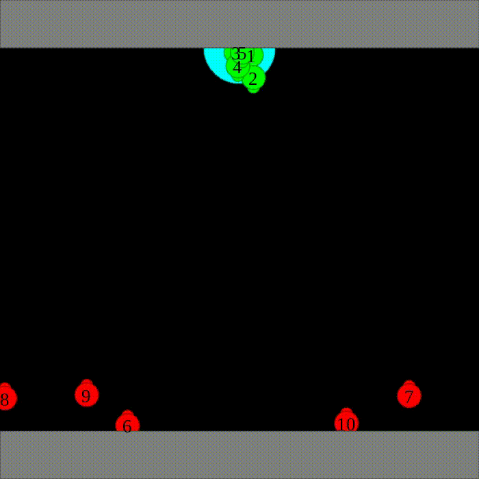

# Emergent Multiagent Strategies

[Ankur Deka](https://www.linkedin.com/in/ankur-deka-120392135) and [Katia Sycara](http://www.cs.cmu.edu/~sycara/)

Robotics Institute, Carnegie Mellon University

This is the official repository of the paper [Natural Emergence of Heterogeneous Strategies in Artificially Intelligent Competitive Teams](https://arxiv.org/abs/2007.03102), presented in a [spotlight talk](https://youtu.be/ltHgKYc0F-E) in Robotics Science and Systems (RSS) 2020 workshop on Heterogeneous Multi-Robot Task Allocation adn Coordination. Increasingly complex multiagent strategies can emerge naturally through competition in a mixed cooperative-competitive environment.

	
	
	

## Installation
See `requirements.txt` file for the list of dependencies. Create an anaconda environment or virtualenv with python 3.6 and setup everything by executing `pip install -r requirements.txt`. 

## Training

### Joint Training
`python train_fortattack.py --save-dir tmp_3` 
See `arguments.py` file for the list of various command line arguments one can set while running the scripts. 

### Ensemble Training of Guards
`python train_fortattack_v2.py --train-guards-only --pretrained-guard --guard-load-dir tmp_1 --guard-ckpt 2520 --attacker-load-dir tmp_1 --attacker-ckpts 220 650 1240 1600 2520 --save-dir tmp_4 --render`

## Testing

### Joint training results
`python test_fortattack.py --test --load-dir tmp_1 --ckpt 220`

### Ensemble training results
`python test_fortattack_v2.py --test --train-guards-only --num-eval-episodes 10 --load-dir tmp_2 --ckpt 5050 --attacker-load-dir tmp_1 --attacker-ckpts 220 --render`

### Trained models
I have provided some pretrained models in `marlsave` directory
1.  `tmp_1`: normal training results. Multiagent strategies corresponding the checkpoints are as follows. Please refer to the paper for details of these strategies.
	1. `ep220`: Flash laser strategy of guards
	1. `ep650`: Sneaking strategy of attackers
	1. `ep1240`: Spreading and flashing strategy of attackers
	1. `ep1600`: Sneaking strategy of attackers
	1. `ep2520`: Smartly spreading strategy of guards

1.  `tmp_2/ep5050.pt`: Guards' policy after ensemble training

## Citing
If you use our code in your research, please cite our paper:  
`@article{deka2020natural,
  title={Natural Emergence of Heterogeneous Strategies in Artificially Intelligent Competitive Teams},
  author={Deka, Ankur and Sycara, Katia},
  journal={arXiv preprint arXiv:2007.03102},
  year={2020}
}
`

## Contact
For any queries, feel free to raise an issue or contact me at adeka@cs.cmu.edu or ankurnet1996@gmail.com.

## Acknowledgment
The environment is built up on [MAPE](https://github.com/openai/multiagent-particle-envs)

The algorithm for this repo is built up on [marl_transfer](https://github.com/sumitsk/marl_transfer)

## License
This project is licensed under the MIT License.
